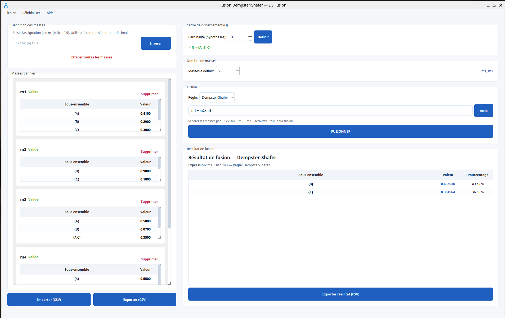

# Dempster-Shafer Fusion Application

This application provides a user-friendly interface to perform the Dempster-Shafer (DS) evidence theory fusion using various combination rules. It allows users to define frames of discernment, input mass functions, and visualize the fusion results.

## Features

-   **Frame of Discernment Definition**: Set up the basic space of hypotheses.
-   **Mass Function Definition**: Input belief assignments (masses) for various subsets of hypotheses.
-   **Multiple Combination Rules**: Supports Dempster-Shafer, Smets (TBM), Yager, Murphy, and PCR6.
-   **Custom Fusion Expression**:2.  **Prepare Resources**:
    *   **Icon**: Create an `.ico` file for Windows (e.g., 256x256 pixels) and an `.icns` file for macOS from your `icon.png` in the `resources/` directory.
    *   **Resource Path**: Ensure your code uses a utility function (like `resource_path` provided below) to correctly access bundled resources when running as an executable.

    *   **Windows Icon**: Use `app.setWindowIcon(QIcon(resource_path(os.path.join("resources", "icon.ico"))))` in your main window code. Define custom combinations of mass functions.
-   **Import/Export**: Save and load mass functions from CSV files.
-   **Result Visualization**: Clear display of fusion results with percentages.
-   **Build & Distribute**: Package the application into a standalone executable using PyInstaller.

---

## Screenshots

Here are some screenshots to illustrate the application's interface and workflow:

### Main Window Overview


*The main application window, showing frame definition, mass input, and fusion controls.*

---

## Requirements

*   Python 3.7+
*   PyQt5
*   NumPy
*   Pandas

You can install the dependencies using pip:
```bash
pip install -r requirements.txt
```

## How to Use

1.  **Set Frame of Discernment**:
    *   Enter the **Cardinality (hypotheses)** (e.g., `3` for {A, B, C}).
    *   Click **Define**. The frame (e.g., `Θ = {A, B, C}`) will be displayed.

2.  **Define Mass Functions**:
    *   Make sure the frame is defined.
    *   In the "Define Masses" section, enter mass assignments in the format: `m<number>(Subset) = value`.
        *   Example: `m1(A) = 0.6`
        *   Example: `m2(B, C) = 0.4`
        *   To represent the whole frame, you can use `theta`, `Θ`, or `Omega`: `m1(theta) = 0.5`.
    * **Remarques importantes** :
        * Le nom de la masse doit correspondre à celui attendu (m1, m2, …). Si vous avez défini “2 masses” utilisez m1 et m2 (pas “m” seul).

        * Le parser actuel accepte les synonymes listés dans parse_subset : '∅', 'Ø', 'empty', '{}', 'Θ', 'Omega', 'theta', 'THETA'.

        * Utilisez le point comme séparateur décimal : 0.5 (pas 0,5). Sinon l’entrée ne sera pas reconnue.

- Vous pouvez aussi écrire explicitement tous les éléments entre accolades si vous préférez {A,B,C}.

    *   Click **Insert**. The defined masses will appear in the "Defined Masses" section.
    *   You can **Import** mass functions from a CSV file.

3.  **Perform Fusion**:
    *   Select the **Combination Rule** from the dropdown.
    *   In the "Fusion Expression" field, enter the masses to combine, separated by `+`.
        *   By default, it suggests `m1 + m2` if you have two masses defined. Click the `↻ Auto` button to refresh this suggestion.
    *   Click **FUSIONNER** (or press Enter in the expression field).
    *   The results will be displayed in the "Fusion Results" section.
    *   You can **Export Result** to a CSV file.

## Building with PyInstaller

This section explains how to package the application into a standalone executable.

1.  **Install PyInstaller and Hooks**:
    Ensure you have PyInstaller and the necessary hooks for PyQt5 installed:
    ```bash
    pip install --upgrade pyinstaller pyinstaller-hooks-contrib
    ```


2.  **Build Command**:
    Navigate to your project's root directory in your terminal (where `main.py` and `requirements.txt` are located).

    *   **For Windows**:
        ```bash
        pyinstaller --noconfirm --onedir --windowed ^
          --name FusionDS ^
          --icon resources\\icon.ico ^
          --add-data "resources;resources" ^
          main.py
        ```
        *   `--onedir`: Creates a folder with the executable and all dependencies. Easier for debugging.
        *   `--onefile`: (Optional) Creates a single executable file. Might start slower.
        *   `--windowed`: Prevents a console window from appearing when the app runs. Remove it for debugging if you need to see output/errors.
        *   `--icon`: Sets the application icon for the executable. Use `\\` as path separator on Windows.
        *   `--add-data "source;destination"`: Copies the `resources` folder and its contents into the bundle. Use `;` on Windows.

    *   **For macOS/Linux**:
        ```bash
        pyinstaller --noconfirm --onedir --windowed \
          --name FusionDS \
          --icon resources/icon.icns \
          --add-data "resources:resources" \
          main.py
        ```
        *   Note the use of `:` as a separator for `--add-data`.

4.  **Find the Executable**:
    After the build process completes, you will find the executable in the `dist/` folder:
    *   `dist/FusionDS/` for `--onedir` builds.
    *   `dist/FusionDS.exe` (or `FusionDS` on macOS/Linux) for `--onefile` builds.

5.  **Distribution**:
    *   For `--onedir` builds, you can zip the entire `dist/FusionDS/` folder and distribute it.
    *   For `--onefile` builds, distribute the single executable file.
    *   Consider using an installer (like NSIS, Inno Setup for Windows) for a more professional distribution.

---